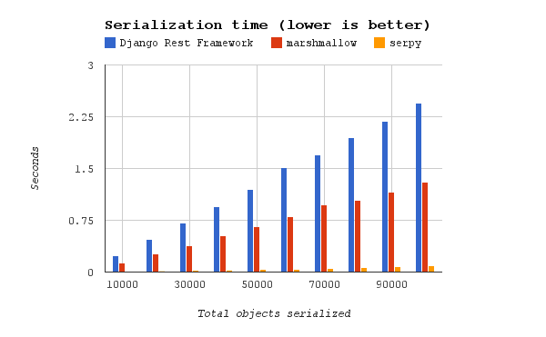
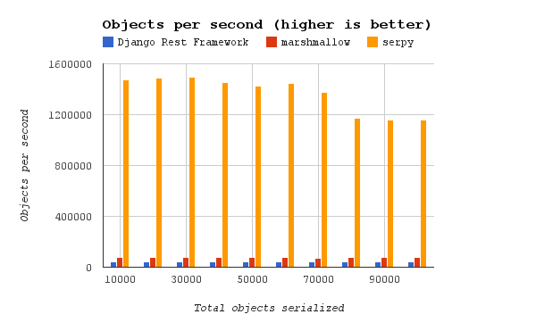
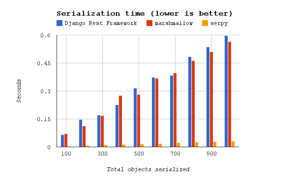
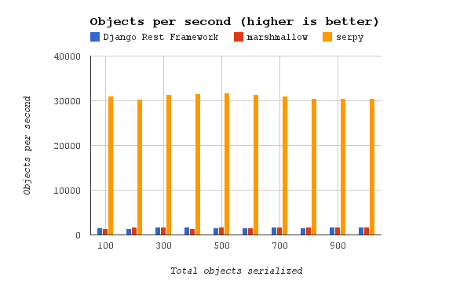

Performance Benchmarks
======================

**serpy** (not `drf-serpy` its benchmarks will be added soon) was compared against two other popular serializer frameworks:

> -   [marshmallow](http://marshmallow.readthedocs.org)
> -   [Django Rest Framework
>     Serializers](http://www.django-rest-framework.org/api-guide/serializers/)

These graphs show the results. The benchmark scripts are found in the
[benchmarks](https://github.com/sergenp/drf-serpy/tree/master/benchmarks)
directory in the **drf_serpy** [GitHub
repository](https://github.com/sergenp/drf-serpy). Run these benchmarks
yourself with:

``` 
$ git clone https://github.com/sergenp/drf-serpy.git drf_serpy && cd drf_serpy
$ python benchmarks/bm_complex.py
$ python benchmarks/bm_simple.py
```

Results
-------

Note these benchmarks are for *serpy* not for *drf_serpy*, new benchmarks are going to be uploaded soon.

These benchmarks were run on a Lenovo T530 with a 2-core 2.5 GHz i5
processor and 8G of memory.


### Simple Benchmark

This benchmark serializes simple objects that have a single field.





### Complex Benchmark

This benchmark serializes nested objects with multiple fields of
different types.




